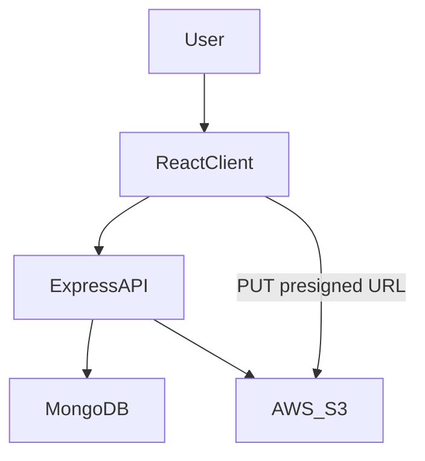

# Scalable File Uploading System

Full-stack file upload system with JWT-based authentication, S3 pre-signed uploads,
and a React dashboard for managing user files.

## Features
- Email/password auth with access + refresh tokens
- Refresh token stored as httpOnly cookie
- Protected client routes and API endpoints
- Pre-signed S3 uploads with two-phase confirmation
- File list, search, pagination, download, and delete
- MIME type and file size validation

## Tech Stack
- Frontend: React, Vite, React Router, Axios
- Backend: Node.js, Express, MongoDB (Mongoose), AWS S3 SDK
- Auth: JWT (access + refresh)

## Architecture


## Project Structure
- `client/` React UI (Vite)
- `server/` Express API + MongoDB + S3 integration
- `server/routes/` API routes
- `server/controllers/` Request handlers
- `server/Models/` Mongoose models

## Prerequisites
- Node.js 18+
- MongoDB (local or hosted)
- AWS S3 bucket and credentials

## Environment Variables (server)
Create a `.env` file inside `server/` with:
```
PORT=5000
MONGO_URL=mongodb://localhost:27017/file_uploads
ACCESS_TOKEN_SECRET=your_access_secret
REFRESH_TOKEN_SECRET=your_refresh_secret
AWS_REGION=ap-south-1
AWS_BUCKET_NAME=your_bucket_name
NODE_ENV=development
```

AWS credentials are loaded via the default SDK provider chain
(for example, `AWS_ACCESS_KEY_ID` and `AWS_SECRET_ACCESS_KEY` in your environment,
or a configured AWS profile).

## Local Development
### Backend
```
cd server
npm install
npm start
```
Server runs at `http://localhost:5000` and allows CORS from `http://localhost:5173`.

### Frontend
```
cd client
npm install
npm run dev
```
Client runs at `http://localhost:5173`.

## API Reference
Base URL: `http://localhost:5000`

### Auth
- `POST /auth/signup` registers a new user account.
- `POST /auth/signin` authenticates a user and returns an access token; sets a refresh token cookie.
- `POST /auth/refresh` rotates the refresh token and returns a new access token.
- `POST /auth/logout` clears the refresh token cookie.

### Files (requires Authorization header)
Set header: `Authorization: Bearer <accessToken>`
- `POST /file/request-upload` validates metadata and returns a pre-signed S3 upload URL.
- `POST /file/confirm-upload` verifies the S3 object exists and finalizes metadata.
- `GET /file/allfiles` returns all files for the current user.
- `GET /file/retrieve/:fileID` returns a pre-signed S3 download URL.
- `DELETE /file/deletefile/:fileId` deletes the file from S3 and removes metadata.

## Upload Flow (Two-Phase)
1. Request metadata and upload URL via `/file/request-upload`
2. Upload directly to S3 using the returned `uploadURL` (HTTP PUT)
3. Confirm the upload via `/file/confirm-upload`
4. The file is now visible in `/file/allfiles`

## Client Usage
- Sign up at `/signup`
- Log in at `/login` (token stored in memory, refresh via cookie)
- After login, access the dashboard at `/home`
- Upload, search, download, and delete files

## Notes and Limitations
- Passwords are currently stored in plain text. Add hashing (e.g. bcrypt) before production use.
- Refresh token cookie uses `secure: false` in rotation; update for production usage.
- Upload limit is 5 MB and only certain MIME types are allowed.

## Planned Enhancements
- Cron for deleting pending files in DB
- Backend + frontend pagination
- Search & sorting (backend + frontend)
- Basic UI wiring
